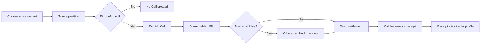
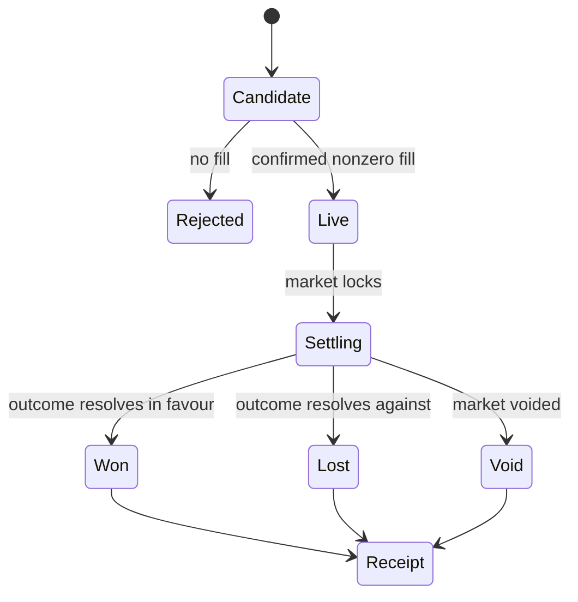
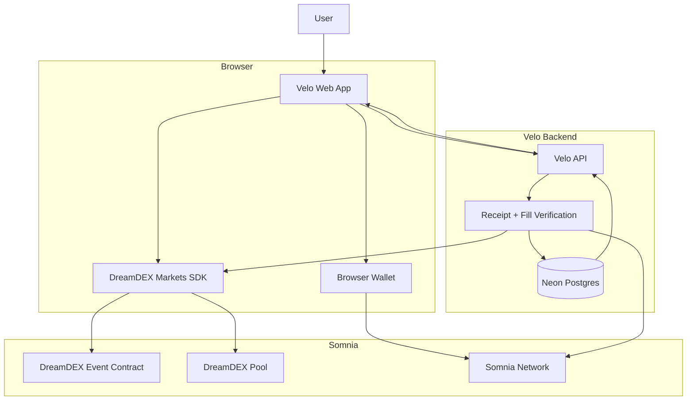
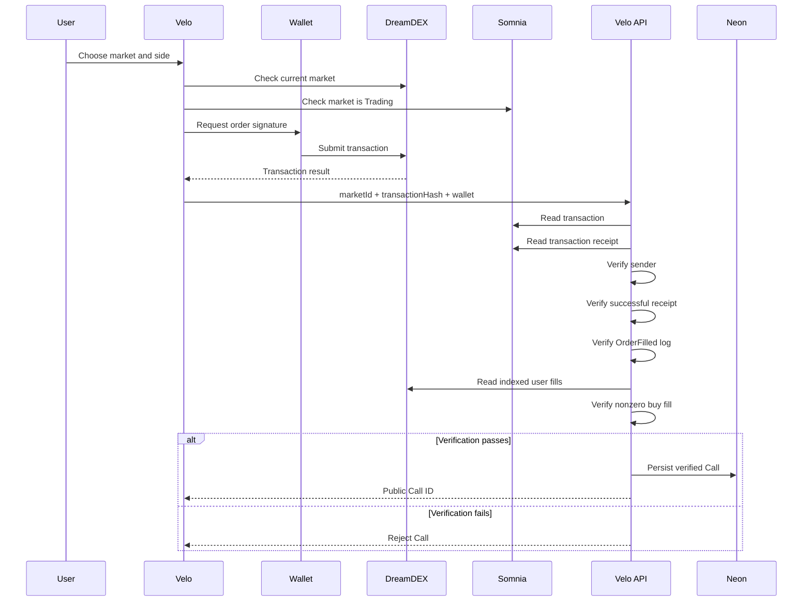

# Velo

**Make the call. Keep the proof.**

Velo turns a real DreamDEX position into a public market call.

A trader takes a position, publishes the Call, shares it while the market is live, and keeps the same record after settlement. Over time, those Calls build a public trading history that can be checked instead of simply claimed.

Velo is built on **Somnia** and **DreamDEX Event Contracts**.

> The product is not another prediction market frontend.
> DreamDEX handles the market infrastructure underneath. Velo turns that infrastructure into public market identity.

---

## What Velo does

Most market calls shared online are difficult to verify.

A trader can post:

> "I called BTC higher."

But the post alone does not prove:

* that they actually took the position;
* when they entered;
* what the market probability was;
* how much of the position filled;
* or whether the call eventually won.

Velo changes that.

A Velo Call is created only after a real DreamDEX position receives a confirmed nonzero fill.

While the underlying market is live, the Call can be shared publicly and another user can independently back the same view.

After settlement, the same Call remains available as part of the trader's public record.

---

## Product loop



The important part is that the public content begins with execution.

Velo does not create a Call first and attempt to prove it later.

---

## Core surfaces

| Route                     | Purpose                                |
| ------------------------- | -------------------------------------- |
| `/`                       | Consumer landing page                  |
| `/app`                    | Live Velo product and Call creation    |
| `/call/:id`               | Public Call and eventual receipt       |
| `/profile/:address`       | Public trader record                   |
| `/api/calls`              | Verified Call persistence              |
| `/api/calls/:id`          | Public Call data                       |
| `/api/profile/:address`   | Public profile data                    |
| `/api/claimable/:address` | Read-only claimable position discovery |
| `/api/health`             | API and persistence health check       |

---

## How Velo uses DreamDEX

DreamDEX is not decorative infrastructure in Velo.

It provides the market, execution, probability, position and settlement primitives the product depends on.

### Live market discovery

Velo reads current binary markets from DreamDEX, then checks the market state on-chain before presenting it as writable.

Only markets still in the Trading state are accepted for new Calls.

### Probability

DreamDEX prices are converted into probabilities.

The probability at execution becomes part of the Call's entry context.

### Real positions

A user does not simply press a button that creates a social post.

The user's wallet submits a real DreamDEX order.

The public Call is created only when Velo verifies that the transaction resulted in a valid fill.

### Settlement

When the underlying Event Contract progresses through its lifecycle, Velo reads the latest state and updates the public Call accordingly.

A live Call therefore becomes a settled record without creating a separate fake result system.

---

## Call lifecycle



Velo's public object changes as reality changes.

The original Call remains the same object.

---

## Architecture



### Responsibilities

| Layer          | Responsibility                                                    |
| -------------- | ----------------------------------------------------------------- |
| Velo frontend  | Product UX, market discovery, wallet interaction and public Calls |
| Browser wallet | User authorization and transaction signing                        |
| DreamDEX SDK   | Market discovery, books, orders, positions and market reads       |
| Somnia         | Transaction execution and on-chain market state                   |
| Velo API       | Verification, public Call indexing and profile reads              |
| Neon Postgres  | Persistent public Call records                                    |

The server does not hold a user private key.

Users sign their own transactions.

---

## Verification model

This is one of the most important parts of Velo.

The frontend cannot arbitrarily tell the API:

```text
"I entered BTC UP at 42%."
```

and have that statement become public truth.

The server independently verifies the transaction.

### Call verification flow



For a Call to become public, Velo verifies:

1. the submitted market exists;
2. the transaction exists;
3. the transaction sender matches the claimed wallet;
4. the transaction succeeded;
5. the transaction contains a DreamDEX `OrderFilled` event for the expected pool;
6. DreamDEX indexes the corresponding user fill;
7. the fill represents a nonzero buy position.

Only then is the Call persisted.

---

## Data integrity

Velo intentionally avoids seeded financial history.

There are no fabricated:

* traders;
* Calls;
* fills;
* win rates;
* probabilities;
* settlements;
* PnL records;
* or historical positions.

If a wallet has never created a verified Velo Call, its record is empty.

That is a product constraint, not an error state.

### Source of truth

| Data                   | Source                      |
| ---------------------- | --------------------------- |
| Live markets           | DreamDEX                    |
| Market lifecycle       | DreamDEX + on-chain state   |
| Order book             | DreamDEX                    |
| Entry probability      | Verified executed fills     |
| Filled quantity        | Verified fills              |
| Transaction sender     | Somnia transaction          |
| Transaction success    | Somnia receipt              |
| Settlement             | DreamDEX market state       |
| Public profile history | Verified Velo Call records  |
| Accuracy               | Settled verified Calls only |

---

## Public Calls

Every verified Call receives a public URL:

```text
/call/:id
```

The public page can show:

* asset;
* interval;
* backed side;
* entry probability;
* current probability while available;
* filled contracts;
* actual execution cost;
* live or settled state;
* proof;
* and the next relevant action.

While the market remains live, another user can choose **Back this Call**.

Backing a Call does not silently copy somebody else's wallet.

The second user creates their own independent DreamDEX position at the price currently available to them.

---

## Public profiles

Each wallet can have a public Velo record:

```text
/profile/:address
```

The profile is composed from verified Velo Calls.

Current profile metrics include:

* number of public Calls;
* number of settled Calls;
* accuracy across settled Calls.

Unsettled and voided Calls do not artificially improve accuracy.

Future versions can expand this into richer reputation metrics such as performance relative to entry probability.

---

## Settlement and disappearing markets

A live market is not the same thing as historical user evidence.

DreamDEX markets roll over and finalized markets may no longer appear in live discovery.

Velo treats those as separate concerns.

Live discovery answers:

> What can I trade now?

The Velo record answers:

> What did this trader actually do before the result was known?

This is why Calls are keyed by their underlying market identity and persisted separately from the live-market list.

---

## Tech stack

| Technology                  | Usage                               |
| --------------------------- | ----------------------------------- |
| Vite                        | Frontend build                      |
| JavaScript                  | Application logic                   |
| `@somnia-chain/markets-sdk` | DreamDEX integration                |
| Viem                        | Wallet and Somnia chain interaction |
| Somnia                      | Execution and on-chain state        |
| DreamDEX Event Contracts    | Market infrastructure               |
| Neon Postgres               | Production persistence              |
| Vercel                      | Web deployment                      |

Current DreamDEX SDK dependency:

```json
"@somnia-chain/markets-sdk": "^0.30.0"
```

---

## Project structure

```text
Velo/
├── api/
│   └── [...path].js
│
├── server/
│   ├── calls-api.js
│   ├── index.js
│   ├── settlement.js
│   └── storage.js
│
├── src/
│   ├── dreamdex.js
│   ├── main.js
│   ├── router.js
│   ├── landing.js
│   ├── product.js
│   └── styles/
│
├── public/
├── scripts/
├── test/
├── index.html
├── vercel.json
├── vite.config.js
└── package.json
```

The exact frontend file structure may change as the final UI pass is completed.

---

## Local development

### Requirements

* Node.js
* npm
* browser wallet compatible with Somnia
* optional Neon Postgres database for persistent storage

Install dependencies:

```bash
npm install
```

Start the development server:

```bash
npm run dev
```

Create a production build:

```bash
npm run build
```

---

## Environment variables

The default client configuration targets Somnia testnet.

Create an `.env.local` file when overrides are needed.

```bash
VITE_DREAMDEX_NETWORK=testnet

VITE_DREAMDEX_INDEXER_URL=
VITE_DREAMDEX_WS_RPC_URL=

DATABASE_URL=

PORT=8787
HOST=0.0.0.0
```

### Important

`DATABASE_URL` is server-only.

Never expose it through a `VITE_` variable.

Use the raw PostgreSQL connection URL:

```text
postgresql://...
```

Do not paste an entire shell command such as:

```text
psql 'postgresql://...'
```

---

## Persistence

When `DATABASE_URL` is available, Velo uses Neon Postgres.

For local development without a database, Velo can fall back to an ignored JSON file.

That local fallback is intended for development only.

Production deployments should use persistent storage.

The database schema is created automatically on the first API request.

---

## API

### Health

```http
GET /api/health
```

Example purpose:

* verify the API is alive;
* inspect persistence mode;
* confirm the deployment is using the intended environment.

### Create verified Call

```http
POST /api/calls
```

Expected body:

```json
{
  "marketId": "0x...",
  "transactionHash": "0x...",
  "walletAddress": "0x..."
}
```

The server does not trust these fields by themselves.

They are inputs to the verification process.

### Read Call

```http
GET /api/calls/:id
```

Proof view:

```http
GET /api/calls/:id?proof=1
```

### Read public profile

```http
GET /api/profile/:address
```

### Read claimable positions

```http
GET /api/claimable/:address
```

This endpoint is read-only.

It does not redeem positions or sign transactions on behalf of users.

---

## Screenshots

Final screenshots will be added after the last UI pass.

Recommended submission screenshots:

1. Velo landing page
2. Live `/app` market view
3. Call creation flow
4. Public live Call
5. Settled receipt
6. Public trader profile
7. Proof view

No placeholder market statistics or fabricated accounts are used just to populate screenshots.

---

## Why Velo

DreamDEX already solves the difficult market infrastructure problem.

Velo explores a different question:

> What consumer product becomes possible when a market position can also become a public piece of identity?

The answer is not simply another trading terminal.

The position becomes a statement.

The fill becomes evidence.

The settlement becomes history.

And repeated history becomes reputation.

That is Velo.
